# 🛒 Amazon Clone (Full-Stack Dynamic Frontend)


A multi-page, highly interactive frontend clone of the Amazon e-commerce platform. Moving beyond a static layout, this project features a client-side state management architecture using **Vanilla JavaScript** and **LocalStorage**. It delivers a seamless, end-to-end user experience—from product discovery and advanced catalog filtering to real-time cart interactions, account validation, and a structured multi-step checkout funnel.

---

## 📚 Prerequisite Knowledge

To understand, modify, or extend the source code of this project, you should be familiar with the following concepts:

* **HTML5 Semantic Structure & Templates:**
    * Advanced layout structuring using markup tags (`<header>`, `<nav>`, `<aside>`, `<main>`, `<section>`, `<footer>`).
    * Data validation patterns and dynamic UI placeholder bindings.
* **Modern CSS3 Layout Architecture:**
    * **Flexbox:** Powering consistent cross-page alignment for navigation headers, control bars, and inline item configurations.
    * **CSS Grid:** Creating fluid layouts for product search feeds and micro-layouts (such as checkout address forms).
    * **Media Queries & Responsive Design:** Adapting fluid columns and UI breakpoints seamlessly across mobile devices, tablets, and wide-screen desktop viewports.
* **Vanilla JavaScript (ES6+) & Web APIs:**
    * **DOM Manipulation:** Utilizing string template literals to dynamically render interface nodes on the fly.
    * **Event-Driven Architecture:** Capturing context propagation (`event.stopPropagation()`), submission handling, and live text input streams.
    * **State Persistence:** Using the HTML5 Web Storage API (`localStorage`) to serialize and preserve application states for shopping carts, user authentication tokens, and custom wishlists across page reloads.

---

## 💻 System & Device Requirements

Because this platform features an optimized, client-side execution model, it runs entirely within the client's browser engine without requiring complex local container runtimes.

### Software Requirements
| Component | Requirement | Purpose |
| :--- | :--- | :--- |
| **Operating System** | Windows, macOS, Linux, or ChromeOS | Any system capable of hosting a modern, evergreen web browser. |
| **Web Browser** | Google Chrome, Mozilla Firefox, Microsoft Edge, or Apple Safari | Built-in rendering engines to parse Flexbox, Grid layouts, and script behaviors accurately. |
| **Code Editor** | Visual Studio Code (Recommended) | To write clean scripts, preview layouts, and leverage development extensions. |

---

## 🖥️ Desktop Screenshots
Comprehensive visual walkthrough showcasing all major application interfaces and user interaction flows.

**Main Landing Page Dashboard:**
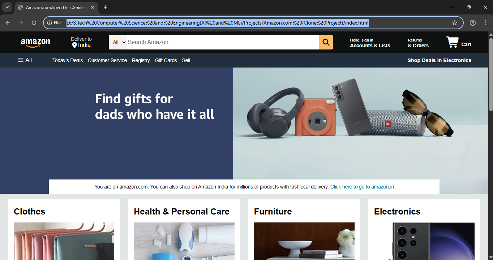

| Navigation Bar | Details Panel |
| :---: | :---: |
| 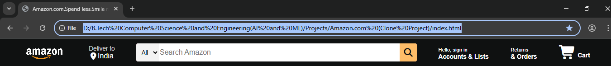 |  |
| **Hero Section** | **Shop Section** |
|  | 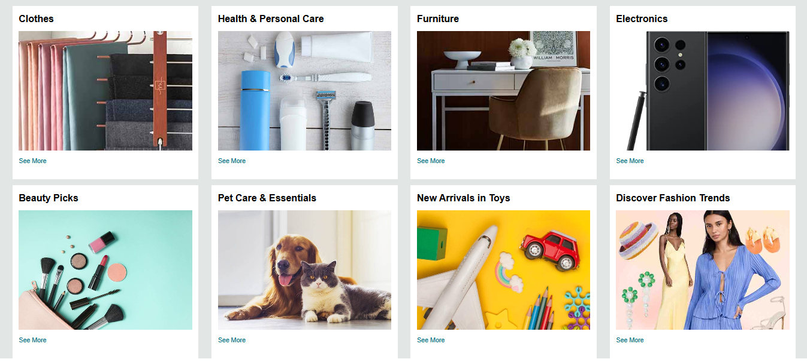 |
| **Footer** | **Copyright** |
| 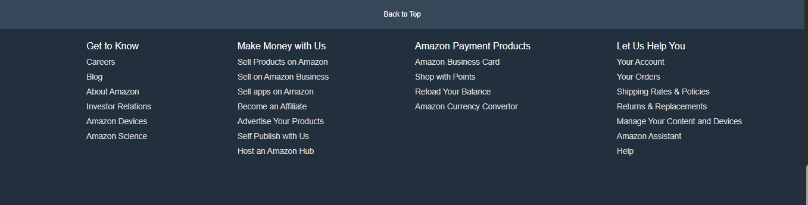 |  |
| **User Authentication & Signup** | **Interactive Shopping Cart** |
| 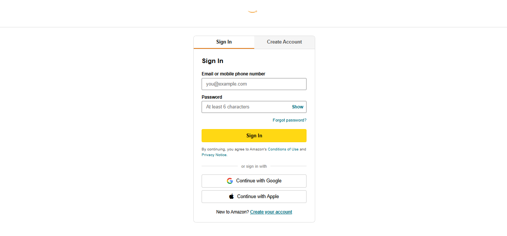 | 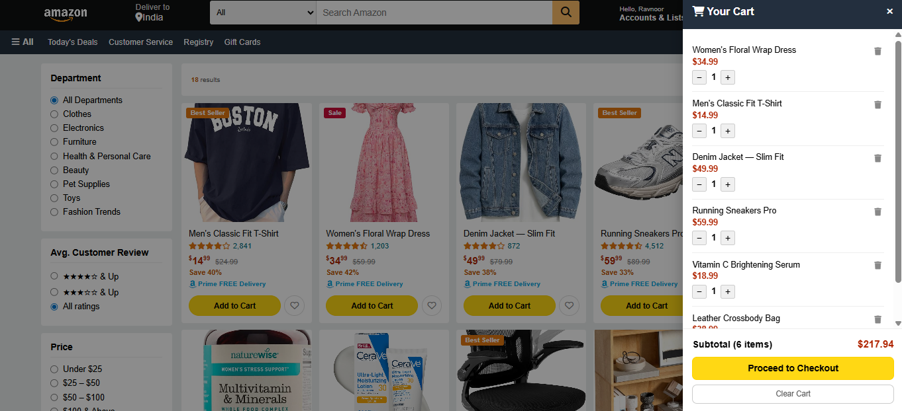 |
| **Dynamic Product Search Feed** | **Product Inspection View** |
|  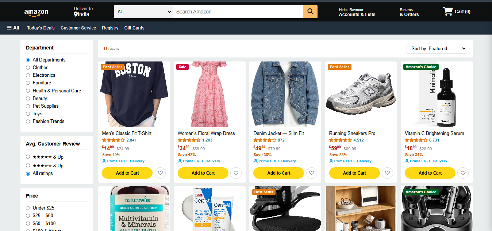 | 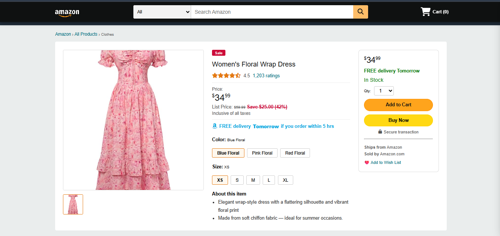 |
 
 **Multi-Step Checkout Flow:**
| Address Details | Payments Panel |
| :---: | :---: |
| 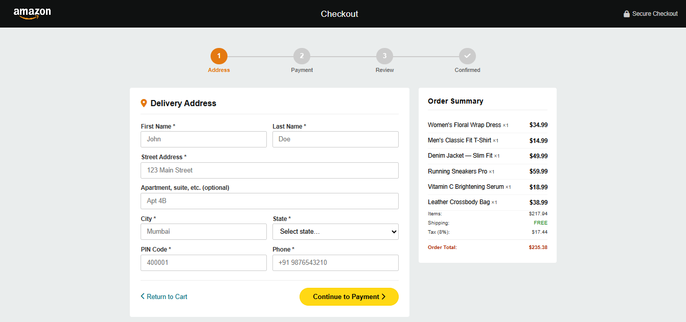 | 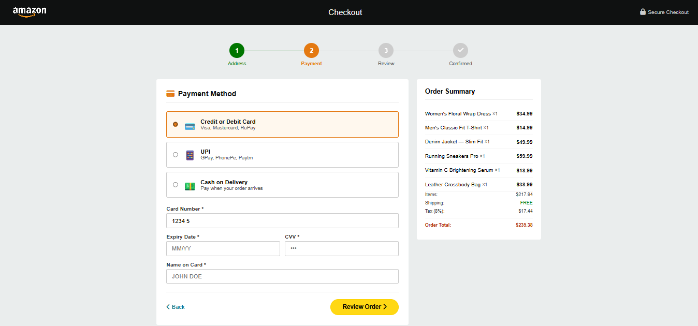 |
| **Review Panel** | **Order Confirmation** |
| 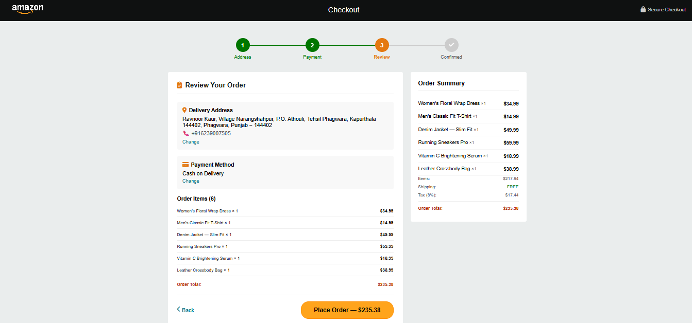 | 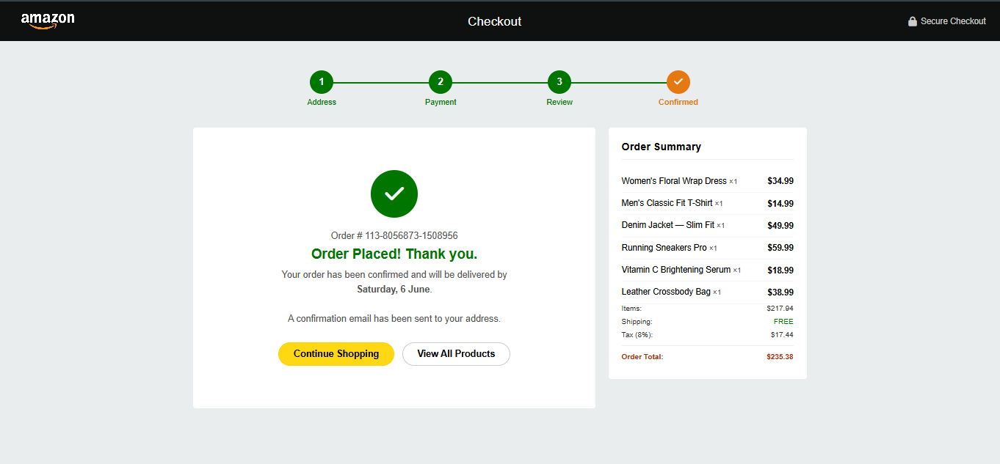 |

---

## ✨ Key Features

This application fully recreates the core behavioral flows of a production e-commerce store:

* **Global Component Injection Framework:** Centralized lifecycle routines systematically assemble cross-page interfaces (like navigation elements and layout footers) to keep your code clean and prevent repeating elements.
* **Granular Search & Multi-Tier Filter Engine:** Users can input queries or browse categories to instantly scan data matrices. Search results can be refined by target category matching, star ratings, explicit price ranges, or sorted via dynamic options (such as price low-to-high or top-rated review rankings).
* **Live Search Suggestion Drops:** Typing into the global search header activates immediate predictive lookups against available titles, rendering floating hint listings that support fluid click selection.
* **Reactive Sliding Cart System:** Clicking the navbar cart icon triggers an absolute side-drawer to slide out. Users can modify item quantities or delete products with immediate total updates without navigating away from their current page view.
* **Client-Side Account Access & Validation:** A secure authentication page manages sign-ins and registration requests. It processes inputs against persistent local records, provides password visibility toggles, features a live password strength analyzer, and updates greeting labels globally upon login.
* **Multi-Step Checkout Pipeline:** A custom check-out assistant carries users through consecutive validation panels:
    1. **Delivery Address:** Captures user shipping information with rigorous data checks.
    2. **Payment Method Selection:** Dynamically shows input cards based on the selected method (Credit Card matching, UPI format checks, or Cash on Delivery).
    3. **Order Review:** Aggregates delivery data, method configurations, and cost outlines (calculating a flat 8% tax margin) before finalization.
    4. **Confirmation Display:** Confirms your order by automatically erasing checkout data, generating a unique order ID string, and calculating expected shipping windows.
* **Keyboard Navigation & System Shortcodes:** Features keyboard listeners to optimize user navigation (pressing `/` highlights search tools instantly, while `Escape` immediately closes active modals or drawers).

---

## 🛠️ Tech Stack

* **Structure:** HTML5 Semantic Markup
* **Styling & Presentation:** CSS3 (Custom Variables, Advanced Flexbox, Multi-Track Grid layouts, Keyframe Animations)
* **Application Logic:** Native Vanilla JavaScript (ES6 Core Modules, Event Capturing, Regex Validation Pipelines)
* **Data Storage Layer:** LocalStorage API
* **Iconography:** FontAwesome Icon Library CDN

---

## 📂 Project Structure
```

amazon-clone/
├── Screenshots/             # High-resolution application preview images
├── amazon_logo.png          # Reusable asset used across brand headers
├── box[1-8]_image.jpg       # Graphical content for index category cards
├── Multiple products.jpg    # Graphical content for product category cards
├── styles.css               # Base layout mechanics, typography rules, and responsive breakpoints
├── products.js              # Source-of-truth object array containing product detail datasets
├── script.js                # Core state managers, cart routines, toast notifications, and event streams
├── navbar.js                # Component lifecycle injection engine for structural layouts
├── index.html               # E-commerce storefront landing dashboard
├── products.html            # Dynamic catalog viewport with multi-tier product filter engines
├── product.html             # Multi-angle variant layout for dedicated item inspections
├── signin.html              # Access validation interface containing live input evaluation utilities
├── checkout.html            # Multi-step checkout pipeline containing data verification routines
└── README.md                # Project architecture and technical developer guide

```
---

## ⚙️ How to Run the Project

Because the storefront logic runs entirely on the client side, there is no need to configure complex package managers or local server instances.

#### (A) Method 1: Local File Execution
1. **Download** or **Clone** this repository to your local workstation.
2. Navigate directly into the root folder directory.
3. Open `index.html` by double-clicking the file to launch it instantly in your default web browser.

#### (B) Method 2: Live Server Dev Mode (Recommended Setup)
To view real-time adjustments smoothly while testing code variations:
1. Open the project folder structure directly inside **Visual Studio Code**.
2. Install the **Live Server** workspace extension from the VS Code Marketplace.
3. Right-click your target file (`index.html`) and choose **"Open with Live Server"**.

---

## 🧠 What I Learned

Architecting this full-featured platform provided hands-on experience with production-style frontend design patterns:
* **Decoupled Application State Design:** Architecting workflows where UI updates rely strictly on localized tracking models instead of scraping raw string data directly off user-facing HTML fields.
* **String Template Literal Dynamic Generation:** Writing flexible functions to cleanly translate deep database rows into valid HTML components on the fly.
* **UX Safety & Input Sanitization:** Implementing custom escape scripts (`.replace(/'/g, "\\'")`) inside inline script binds to prevent broken string execution when names or descriptions contain apostrophes.
* **Component Serialization Mechanics:** Managing conversion loops using `JSON.stringify()` and `JSON.parse()` to seamlessly store, fetch, and update nested state data inside web browsers.

---

## 🤝 Contributing

This application is primarily a personal portfolio milestone, but code optimization reviews and styling enhancements are always welcome!
1. **Fork** the master repository.
2. Form your dedicated operational feature branch (`git checkout -b feature/AmazingEnhancement`).
3. Push changes cleanly and submit an official **Pull Request** for analysis.

---

## 👤 Author

**~ Ravnoor Kaur**

[](https://github.com/ravnoor-1407)
[](https://www.linkedin.com/in/ravnoor-kaur-rk2007)